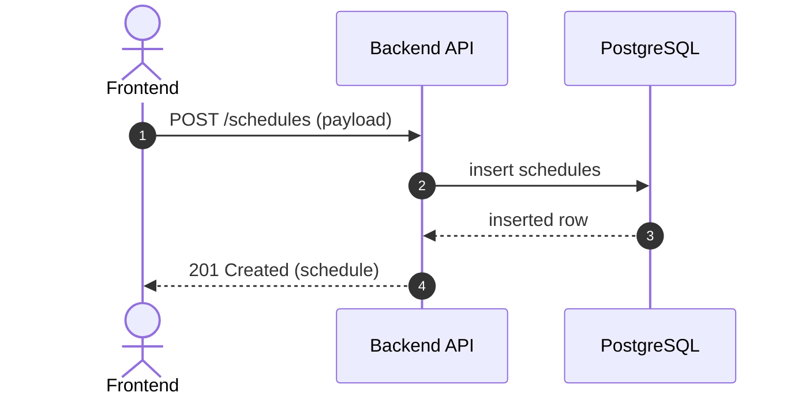

# API仕様書（メンバー勤務予定管理）

本書は `概要.md` の「API設計」「データモデル」をベースに、教育用として最小限のAPI仕様を定義する。

---

## 1. 共通

ベースURL

- `/`

レスポンス形式

- JSON
- 日付: `YYYY-MM-DD`
- 時刻: `HH:mm:ss`（フロント表示は `HH:mm` 推奨）
- 日時: ISO 8601（例: `2026-03-11T10:00:00+09:00`）

エラー（共通）

|HTTP|code|例|説明|
|---:|---|---|---|
|400|VALIDATION_ERROR|必須不足|入力不正|
|404|NOT_FOUND|対象なし|IDに対応するデータなし|
|409|CONFLICT|一意制約|重複・排他など|
|500|INTERNAL_ERROR|想定外|サーバ内部エラー|

エラーレスポンス例

```json
{
  "code": "VALIDATION_ERROR",
  "message": "date is required",
  "details": [
    {"field": "date", "reason": "required"}
  ]
}
```

---

## 2. Mermaid（代表的な呼び出し）

予定登録の代表シーケンス



---

## 3. マスタ/メンバー

### 3.1 チーム一覧取得（推奨）

`teams` がデータモデルにあるため、UIで表示する場合に使用する。

`GET /teams`

レスポンス 200

```json
[
  {"id": 1, "teamCode": "TEAM_A", "name": "第1チーム"}
]
```

---

### 3.2 メンバー一覧取得

`GET /users`

クエリ（任意）

- `teamId`（number）

レスポンス 200

```json
[
  {
    "id": 10,
    "employeeCode": "E0001",
    "name": "山田 太郎",
    "team": {"id": 1, "teamCode": "TEAM_A", "name": "第1チーム"},
    "createdAt": "2026-03-11T10:00:00+09:00"
  }
]
```

備考

- `team` をネストで返すか、`teamId`/`teamName` のフラットで返すかは実装で選択可（教育用はネスト推奨）

---

### 3.3 勤務区分一覧取得（任意だが推奨）

フロントのプルダウンを固定値にしないために用意する。

`GET /work-status-types`

レスポンス 200

```json
[
  {"id": 1, "statusCode": "OFFICE", "statusName": "出社"}
]
```

---

## 4. 予定

### 4.1 予定一覧取得

`GET /schedules`

クエリ

- `date`（`YYYY-MM-DD`）任意
- `userId`（number）任意
- `from`（`YYYY-MM-DD`）任意
- `to`（`YYYY-MM-DD`）任意

ルール

- `date` と `from/to` は同時指定不可
- `from` 指定時は `to` も必須（逆も同様）

レスポンス 200

```json
[
  {
    "id": 100,
    "user": {"id": 10, "name": "山田 太郎"},
    "targetDate": "2026-03-11",
    "statusType": {"id": 1, "statusCode": "OFFICE", "statusName": "出社"},
    "startTime": "09:00:00",
    "endTime": "18:00:00",
    "comment": "客先訪問あり",
    "createdAt": "2026-03-11T10:00:00+09:00",
    "updatedAt": "2026-03-11T10:00:00+09:00"
  }
]
```

---

### 4.2 予定登録

`POST /schedules`

リクエスト

```json
{
  "userId": 10,
  "targetDate": "2026-03-11",
  "statusTypeId": 1,
  "startTime": "09:00:00",
  "endTime": "18:00:00",
  "comment": "客先訪問あり"
}
```

バリデーション

- 必須: `userId`, `targetDate`, `statusTypeId`
- 時刻: `startTime` と `endTime` が両方ある場合は `startTime <= endTime`

レスポンス 201

```json
{
  "id": 100,
  "userId": 10,
  "targetDate": "2026-03-11",
  "statusTypeId": 1,
  "startTime": "09:00:00",
  "endTime": "18:00:00",
  "comment": "客先訪問あり",
  "createdAt": "2026-03-11T10:00:00+09:00",
  "updatedAt": "2026-03-11T10:00:00+09:00"
}
```

---

### 4.3 予定更新

`PUT /schedules/{id}`

パス

- `id`（number）

リクエスト（PUTは「全項目更新」を想定）

```json
{
  "userId": 10,
  "targetDate": "2026-03-11",
  "statusTypeId": 2,
  "startTime": null,
  "endTime": null,
  "comment": "在宅に変更"
}
```

レスポンス 200

```json
{
  "id": 100,
  "userId": 10,
  "targetDate": "2026-03-11",
  "statusTypeId": 2,
  "startTime": null,
  "endTime": null,
  "comment": "在宅に変更",
  "createdAt": "2026-03-11T10:00:00+09:00",
  "updatedAt": "2026-03-11T12:00:00+09:00"
}
```

---

### 4.4 予定削除

`DELETE /schedules/{id}`

レスポンス

- 204 No Content

---

## 5. 集計

### 5.1 月次集計取得

`GET /reports/monthly`

クエリ

- `yearMonth`（`YYYY-MM`）必須
- `teamId`（number）任意（チームで絞り込む場合）

レスポンス 200

```json
[
  {
    "user": {"id": 10, "name": "山田 太郎"},
    "yearMonth": "2026-03",
    "officeDays": 10,
    "remoteDays": 5,
    "paidLeaveDays": 1,
    "amLeaveCount": 0,
    "pmLeaveCount": 1,
    "absenceDays": 0,
    "updatedAt": "2026-03-31T23:59:59+09:00"
  }
]
```

備考

- バッチが未実装の場合、API側で `schedules` を集計して返す方式でもよい（教育用の段階に応じて選択）

