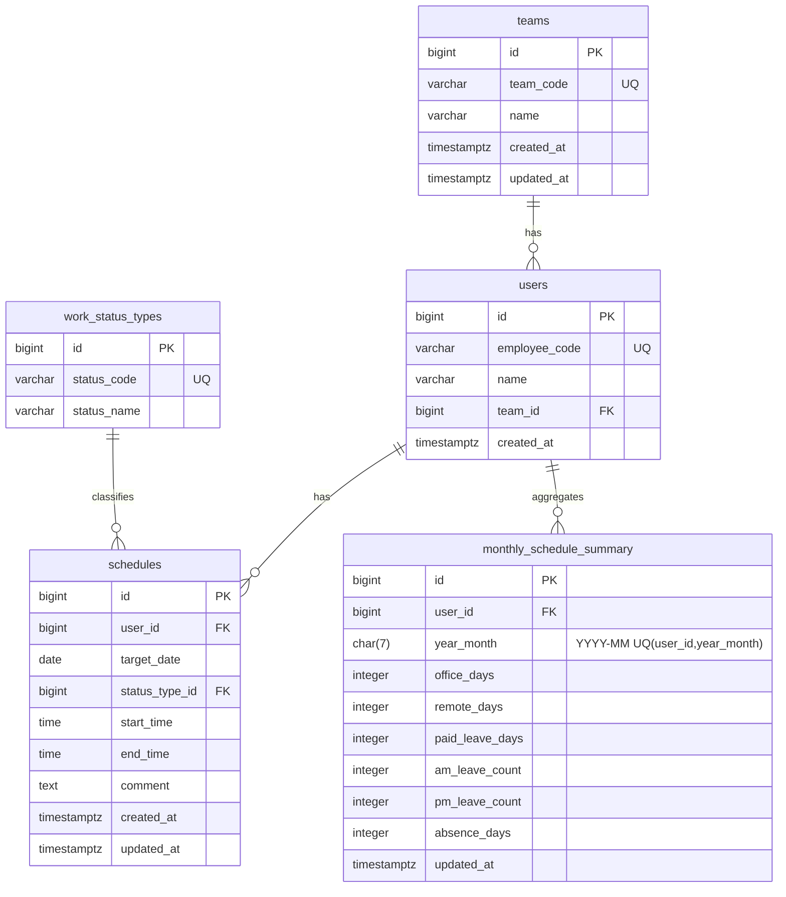

# DB定義書（メンバー勤務予定管理）

本書は `概要.md` の「データモデル」をもとに、PostgreSQL を前提としてテーブル定義・制約・索引の案をまとめる。

---

## 1. ER図



---

## 2. 共通方針

- 文字コード: UTF-8
- 日時: `timestamptz`
- 主キー: `bigserial`（学習目的のため単純化）
- 監査系: `created_at` / `updated_at` はアプリ側で設定（トリガーは発展課題）

---

## 3. テーブル定義

### 3.1 teams（チーム）

|項目|型|NULL|キー|説明|
|---|---|---:|---|---|
|id|bigserial|NO|PK|チームID|
|team_code|varchar(50)|NO|UQ|チームコード（例: `TEAM_A`）|
|name|varchar(100)|NO||チーム名|
|created_at|timestamptz|NO||作成日時|
|updated_at|timestamptz|NO||更新日時|

制約案

- `unique(team_code)`

索引案

- `idx_teams_team_code`（`team_code`）

---

### 3.2 users（メンバー）

|項目|型|NULL|キー|説明|
|---|---|---:|---|---|
|id|bigserial|NO|PK|ユーザーID|
|employee_code|varchar(50)|NO|UQ|社員番号|
|name|varchar(100)|NO||名前|
|team_id|bigint|NO|FK|チームID（`teams.id`）|
|created_at|timestamptz|NO||作成日時|

制約案

- `unique(employee_code)`
- `foreign key (team_id) references teams(id)`

索引案

- `idx_users_team_id`（`team_id`）
- `idx_users_employee_code`（`employee_code`）

---

### 3.3 work_status_types（勤務区分マスタ）

|項目|型|NULL|キー|説明|
|---|---|---:|---|---|
|id|bigserial|NO|PK|区分ID|
|status_code|varchar(50)|NO|UQ|区分コード|
|status_name|varchar(100)|NO||区分名|

想定初期データ

|status_code|status_name|
|---|---|
|OFFICE|出社|
|REMOTE|在宅|
|PAID_LEAVE|休暇|
|AM_LEAVE|午前休|
|PM_LEAVE|午後休|
|ABSENCE|欠勤|

制約案

- `unique(status_code)`

---

### 3.4 schedules（勤務予定）

|項目|型|NULL|キー|説明|
|---|---|---:|---|---|
|id|bigserial|NO|PK|ID|
|user_id|bigint|NO|FK|ユーザーID（`users.id`）|
|target_date|date|NO||対象日|
|status_type_id|bigint|NO|FK|勤務区分（`work_status_types.id`）|
|start_time|time|YES||開始時刻（勤務区分により任意）|
|end_time|time|YES||終了時刻（勤務区分により任意）|
|comment|text|YES||コメント|
|created_at|timestamptz|NO||作成日時|
|updated_at|timestamptz|NO||更新日時|

制約案

- `foreign key (user_id) references users(id)`
- `foreign key (status_type_id) references work_status_types(id)`
- （任意）`check (end_time is null or start_time is null or end_time >= start_time)`

索引案

- `idx_schedules_target_date`（`target_date`）
- `idx_schedules_user_id`（`user_id`）
- `idx_schedules_user_date`（`user_id, target_date`）

備考

- 「1日1件」にしたい場合は `unique(user_id, target_date)` を追加（要件次第）

---

### 3.5 monthly_schedule_summary（月次集計）

|項目|型|NULL|キー|説明|
|---|---|---:|---|---|
|id|bigserial|NO|PK|ID|
|user_id|bigint|NO|FK|ユーザーID（`users.id`）|
|year_month|char(7)|NO|UQ|年月（`YYYY-MM`）|
|office_days|integer|NO||出社日数|
|remote_days|integer|NO||在宅日数|
|paid_leave_days|integer|NO||休暇日数|
|am_leave_count|integer|NO||午前休回数|
|pm_leave_count|integer|NO||午後休回数|
|absence_days|integer|NO||欠勤日数|
|updated_at|timestamptz|NO||更新日時|

制約案

- `foreign key (user_id) references users(id)`
- `unique(user_id, year_month)`
- （任意）`check (year_month ~ '^[0-9]{4}-[0-9]{2}$')`
- （任意）各カウントは `>= 0`

索引案

- `idx_monthly_summary_year_month`（`year_month`）

---

## 4. DDL例（参考）

学習用の参考例（プロジェクトに取り込むかは任意）。

```sql
create table teams (
  id bigserial primary key,
  team_code varchar(50) not null unique,
  name varchar(100) not null,
  created_at timestamptz not null,
  updated_at timestamptz not null
);

create table users (
  id bigserial primary key,
  employee_code varchar(50) not null unique,
  name varchar(100) not null,
  team_id bigint not null references teams(id),
  created_at timestamptz not null
);
```

