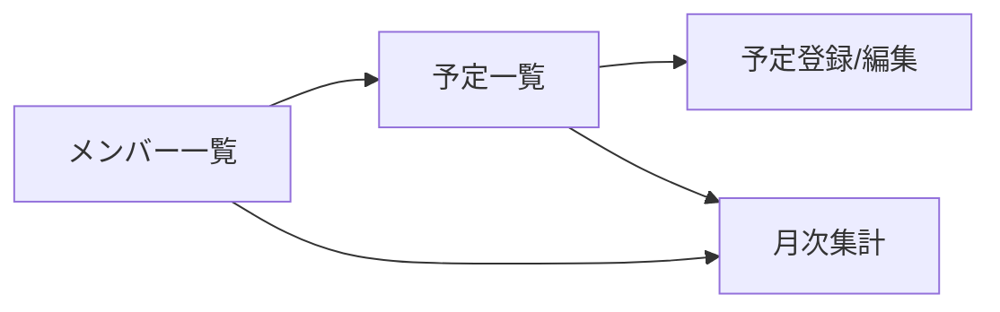

# 画面定義書（メンバー勤務予定管理）

本書は `概要.md` の「画面」「機能一覧」をベースに、実装に必要な画面要素・操作・バリデーションの最低限を定義する。

---

## 1. 画面遷移

---

## 2. 共通仕様

- 対象ユーザー: チームメンバー（ログインは発展課題のため想定しない）
- 表示時刻: `HH:mm`
- 日付: `YYYY-MM-DD`
- エラーメッセージ: APIエラーを画面上部に表示（詳細はAPI仕様書）

---

## 3. 画面一覧

### 3.1 メンバー一覧

目的

- 登録メンバーを確認し、予定・集計に遷移する

表示項目（テーブル）

- 名前
- 社員番号
- チーム名（`teams.name`）

操作

- 行クリック: 「予定一覧」へ遷移（`userId` を引き継ぐ）
- 「月次集計」ボタン: 月次集計画面へ遷移（任意で `teamId` も引き継ぐ）

入力・バリデーション

- なし（検索を付ける場合は発展課題）

---

### 3.2 予定一覧

目的

- 指定日（または期間）の勤務予定を一覧表示し、登録/編集/削除を行う

表示項目（テーブル）

- 日付
- 名前
- 勤務区分
- 開始時刻
- 終了時刻
- コメント

検索/絞り込み（基本）

- 日付指定（`date`）
- メンバー指定（`userId`）

検索/絞り込み（任意）

- 期間（`from`〜`to`）※ `date` と排他にする（どちらか一方）

操作

- 「新規登録」: 予定登録/編集へ遷移（新規）
- 行の「編集」: 予定登録/編集へ遷移（対象 `scheduleId` を引き継ぐ）
- 行の「削除」: 確認ダイアログ → 削除API呼び出し

バリデーション（検索）

- `from <= to`
- `date` と `from/to` は同時指定不可

---

### 3.3 予定登録/編集

目的

- 勤務予定を登録または更新する

入力項目

- 日付（必須）
- 勤務区分（必須）
- 開始時刻（任意）
- 終了時刻（任意）
- コメント（任意）

操作

- 「登録/更新」: POST/PUT を呼び出し、成功後に一覧へ戻る
- 「キャンセル」: 一覧へ戻る

バリデーション（クライアント）

- 必須: 日付、勤務区分
- 時刻: `開始 <= 終了`（両方入力時）
- 時刻入力の扱い（学習用の簡易ルール）
  - `OFFICE` / `REMOTE` の場合: 時刻は任意（入力があれば保存）
  - `PAID_LEAVE` / `AM_LEAVE` / `PM_LEAVE` / `ABSENCE` の場合: 時刻は未入力を推奨（入力されてもAPI側で許可する/弾くはどちらでも可。どちらにするかはチームで決める）

---

### 3.4 月次集計

目的

- メンバーごとの月次集計（出社/在宅/休暇等）を確認する

入力項目

- 年月（必須、`YYYY-MM`）
- （任意）チーム（`teamId`）

表示項目（テーブル）

- 名前
- 出社日数
- 在宅日数
- 休暇日数
- 午前休回数
- 午後休回数
- 欠勤日数

操作

- 「表示」: 集計取得API呼び出し
- （任意）「集計再作成」: バッチ実行（発展課題。UIからは呼ばない想定でも可）

バリデーション

- 年月は `YYYY-MM` 形式

